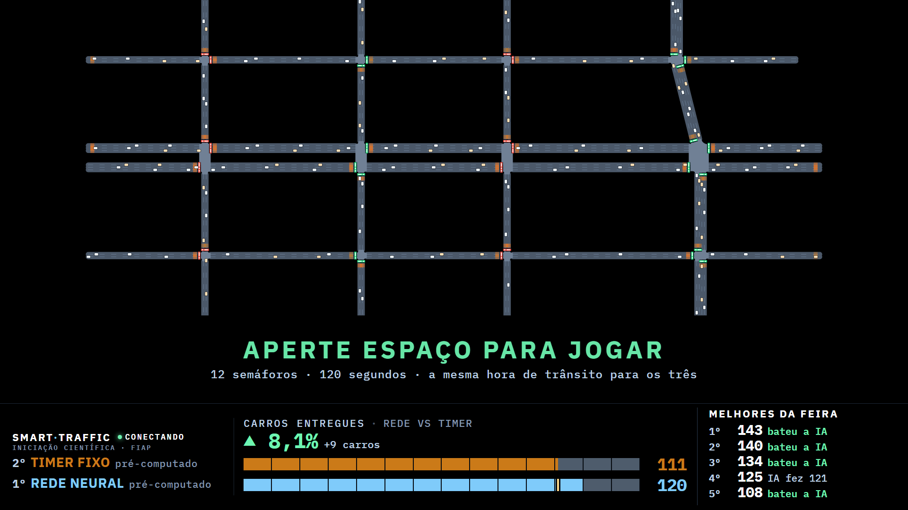

# SmartTraffic — a maquete da feira

Semáforos controlados por **Reinforcement Learning**, numa maquete física. A
simulação é **projetada no chão** por um projetor montado numa torre de 2 m, e
prédios em miniatura ficam sobre os quarteirões. O público assiste à RL competindo
com um timer fixo, depois **joga** — controlando os 12 semáforos pelo teclado — e
entra num quadro de recordes que expira, para o campeão mudar ao longo do dia.

Iniciação Científica · FIAP.

> **Para quem vai apresentar:** o guia da feira, passo a passo —
> **[ler online](https://claude.ai/artifact/LfHvi68uhsrk8PAc744zqW)** ou
> [`docs/GUIA_DA_FEIRA.html`](docs/GUIA_DA_FEIRA.html) no repo.
>
> **Relatório de validação:** o sistema rodando de verdade, com screenshot de cada
> tela e o checklist com evidência.
> **[Ler online](https://claude.ai/artifact/T8yZoRSHVVnuGrs9AaqR27)** (abre bem no
> celular) · ou [`docs/validation/relatorio.html`](docs/validation/relatorio.html) no
> repo, que é autocontido: baixe e abra com duplo clique, sem servidor e sem rede.



---

## Índice

1. [Pré-requisitos](#1-pré-requisitos)
2. [Instalação](#2-instalação)
3. [Como rodar](#3-como-rodar)
4. [Controles](#4-controles)
5. [Parâmetros que você vai querer ajustar](#5-parâmetros-que-você-vai-querer-ajustar)
6. [Estrutura de pastas](#6-estrutura-de-pastas)
7. [Problemas comuns](#7-problemas-comuns)
8. [A regra que barateia tudo: aqui não se copia ambiente](#8-a-regra-que-barateia-tudo-aqui-não-se-copia-ambiente)
9. [Documentação](#9-documentação)

---

## 1. Pré-requisitos

| o quê | versão | como conferir |
|---|---|---|
| Windows | 10/11 | — |
| Python | 3.12 | `python -V` |
| [SUMO](https://eclipse.dev/sumo/) | 1.19+ | `echo %SUMO_HOME%` tem de responder |
| Chrome ou Edge | recente | serve a projeção e roda as fotos de bancada |
| projetor | — | ver [`docs/PROJECAO.md`](docs/PROJECAO.md) §1 para a montagem |

`SUMO_HOME` precisa estar no ambiente — é de lá que saem `traci` e `sumolib`, que
não vêm do pip. Se `echo %SUMO_HOME%` vier vazio, defina:

```powershell
setx SUMO_HOME "C:\Program Files (x86)\Eclipse\Sumo"
# feche e reabra o terminal
```

## 2. Instalação

Este repo **não tem `.venv` próprio, de propósito**: usa o do `smart-traffic`, que é
o mesmo do `smart-traffic-rl`. Assim os três repos medem com o mesmo ambiente e os
números não divergem por causa de uma versão diferente de `numpy`.

Os três repos ficam lado a lado:

```
ic\
├─ smart-traffic\           <- dono do .venv
├─ smart-traffic-maquete\   <- dono do pacote `sim` (o ambiente de RL)
└─ smart-traffic-feira\     <- este repo
```

```powershell
# 1. o ambiente, com as versões exatas em que a suíte fecha
..\smart-traffic\.venv\Scripts\python.exe -m pip install -r requirements.txt

# 2. o pacote `sim` do maquete, em modo editável (NÃO se copia ambiente aqui)
..\smart-traffic\.venv\Scripts\python.exe -m pip install -e ..\smart-traffic-maquete --no-deps

# 3. este repo
..\smart-traffic\.venv\Scripts\python.exe -m pip install -e . --no-deps

# 4. confere: a suíte inteira, sem precisar de SUMO
.\run_testes.ps1
```

O passo 4 tem de terminar em `802 passed`. Se não terminar, pare aqui — não adianta
subir a feira com a suíte vermelha.

## 3. Como rodar

### O dia da feira — um comando

```powershell
.\run_feira.ps1
```

Ele imprime uma URL (`http://127.0.0.1:8080/`). Abra **na tela do projetor** e
aperte <kbd>F</kbd> para tela cheia. Pronto: a tela padrão já está rodando.

O fluxo é automático e não precisa de operador:

```
tela padrão  ──ESPAÇO──>  preparando  ──>  3·2·1  ──>  rodada (120 s)
     ^                                                        │
     └──────────────── 7 s ◄──── resultado ◄──────────────────┘
```

Na **tela padrão** a rede neural e o timer fixo rodam ao vivo, na mesma hora de
trânsito, e a vantagem medida aparece embaixo do mapa. Quando alguém joga, os dois
feeds descem (os 120 s do visitante não dividem CPU com dois SUMOs) e voltam quando a
rodada acaba.

### Variações

```powershell
.\run_feira.ps1 -Porta 9000        # outra porta
.\run_feira.ps1 -Ensaio            # só o jogo, sem a tela padrão (poupa CPU)
.\run_feira.ps1 -SoProjecao        # só a tela padrão, sem jogo (vitrine)
.\run_feira.ps1 -Extra '--ritmo 1' # tempo real em vez de 2x
```

### Outras coisas que este repo roda

```powershell
.\run_testes.ps1                            # a suíte (não precisa de SUMO)
.\run_testes.ps1 -Lint                      # + ruff

# uma foto de cada tela, em 1920x1080, sem projetor e sem SUMO
python scripts\projecao_telas.py --saida docs\validation\telas --sem-diag

# a auditoria de cor e de legibilidade (contraste e minutos de arco)
python scripts\projecao_contraste.py

# gravar um turno da feira e auditar depois
python scripts\valida_fluxo.py --porta 8080 --saida turno.jsonl
python scripts\valida_fluxo.py --analisa turno.jsonl

# refazer o relatório HTML de validação (gera as DUAS saídas)
#   docs\validation\relatorio.html            autocontido, para abrir do disco
#   docs\validation\relatorio.artifact.html   para publicar como Artifact (fora do git)
python scripts\relatorio_validacao.py

# a rodada no terminal, sem projeção (o modo degradado do modo degradado)
python -m feira.jogo
```

## 4. Controles

### O visitante

| quando | tecla | o que faz |
|---|---|---|
| tela padrão | letras e números | digita o apelido |
| tela padrão | <kbd>ENTER</kbd> | confirma o apelido |
| tela padrão | <kbd>ESPAÇO</kbd> | começa a rodada (campo vazio = *Visitante N*) |
| tela padrão | <kbd>Backspace</kbd> / <kbd>Esc</kbd> | apaga / limpa o apelido |
| na rodada | <kbd>Q</kbd> <kbd>W</kbd> <kbd>E</kbd> <kbd>R</kbd><br><kbd>A</kbd> <kbd>S</kbd> <kbd>D</kbd> <kbd>F</kbd><br><kbd>Z</kbd> <kbd>X</kbd> <kbd>C</kbd> <kbd>V</kbd> | os 12 semáforos, na posição do mapa |

Cada cruzamento tem uma **placa** com a letra da tecla, e ela fala a mesma língua do
farol embaixo: clara = pode apertar; apagada com anel e os segundos = ainda no verde
mínimo, espere; amarela = pedido registrado; verde = trocou; vermelha piscando =
cedo demais.

### O operador

| tecla | o que faz |
|---|---|
| <kbd>F</kbd> | tela cheia |
| <kbd>I</kbd> | régua de bancada (escala, mm/px, minutos de arco, seed e sha) |
| <kbd>H</kbd> | liga/desliga o HUD |
| <kbd>R</kbd> / <kbd>M</kbd> | girar / espelhar (projetor de cabeça para baixo, espelho) |
| <kbd>↑</kbd><kbd>↓</kbd><kbd>←</kbd><kbd>→</kbd> | alinhar a imagem com a maquete |
| <kbd>+</kbd> <kbd>−</kbd> | zoom · <kbd>,</kbd> <kbd>.</kbd> tamanho do texto · <kbd>0</kbd> reset |
| <kbd>T</kbd> / <kbd>G</kbd> / <kbd>D</kbd> / <kbd>V</kbd> | grade de teste · asfalto · pegada · carro real |
| <kbd>Esc</kbd> 3× em 1,5 s | aborta a rodada em curso |

Alinhamento e zoom ficam salvos no `localStorage`: fechar e reabrir a janela do
projetor não perde o ajuste da maquete.

Há ainda uma página de operador em `http://127.0.0.1:8080/operador.html` (abortar,
pular resultado, marcar rodada de teste, renomear/remover marca). Não é necessária
para a rodada.

## 5. Parâmetros que você vai querer ajustar

Todos têm flag de linha de comando — **prefira a flag** a editar o código. A coluna
do arquivo é onde mora o valor padrão, para quando quiser mudar de vez.

| o quê | flag | padrão | onde o padrão mora |
|---|---|---|---|
| segundos da tela de **resultado** | `--resultado-s 7` | 7 s | [`scripts/projecao_servidor.py:89`](scripts/projecao_servidor.py#L89) (preset) e [`feira/jogo/motor.py:232`](feira/jogo/motor.py#L232) (motor) |
| **validade do quadro** de recordes | `--ranking-validade 30` | 30 min | [`scripts/projecao_servidor.py:95`](scripts/projecao_servidor.py#L95) — `0` = nunca expira |
| **ritmo** da apresentação | `--ritmo 2` | 2× | [`scripts/projecao_servidor.py:96`](scripts/projecao_servidor.py#L96) — só apresentação, a simulação não muda |
| seeds em rodízio (a hora de trânsito) | `--seeds 100..111` | 100–111 | [`scripts/projecao_servidor.py:98`](scripts/projecao_servidor.py#L98) |
| duração de uma volta da **tela padrão** | `--ocioso-duracao 300` | 300 s sim. | [`scripts/projecao_servidor.py:90`](scripts/projecao_servidor.py#L90) — medido; ver abaixo |
| contagem regressiva (3·2·1) | — | 3 s | [`feira/jogo/motor.py:231`](feira/jogo/motor.py#L231) (`contagem_s`) |
| pasta do quadro de recordes | `--ranking-dir` | `results/feira` | um arquivo por dia |
| porta | `--porta 8080` | 8080 | — |

### Por que a volta da tela padrão é de 300 s

Porque a **manchete** (`▲ X% · +N carros`) perde representatividade com o tempo, e o
número saiu de uma volta longa gravada do fio (seed 100, 936 s simulados):

| momento | manchete acumulada |
|---|---|
| t = 450 | **+11,0 %** |
| t = 600 | +6,8 % |
| t = 800 | +3,5 % |
| t = 1000 | +2,0 % |
| t = 1268 | +1,9 % |

> ⚠️ **A malha não degrada** — é importante não confundir as duas coisas. A população
> fica em 130–170 ativos a volta inteira, em cima do regime calibrado de 158, e a fila
> da rede neural até **melhora** (30 → 26) enquanto a do timer não sai de 45–48.
>
> O que encolhe é a **razão**: `entregues` é contador acumulado, a vazão desta rede já
> está quase saturada por construção, e quase toda a vantagem é ganha nos primeiros
> ~150 s. A diferença absoluta fica parada em ~+15 a +30 carros enquanto o denominador
> cresce sem parar.

Com 300 s a manchete fica entre **+7 % e +12 %** — a mesma ordem do que a rodada mostra
ao visitante (128 × 109 na janela de 120 s = +17 %), então as duas telas contam a mesma
história. Custa um reinício a cada 5 min de relógio, com ~1,5 s de aquecimento por
braço. Para a volta longa de volta: `--ocioso-duracao 1800`.

Além do relógio, a volta também termina **sozinha** quando a malha enche: o vigia de
população do `scripts/projecao_ocioso.py` aborta acima de 320 ativos por 60 s seguidos
(≈2× o regime calibrado). E ela termina quando alguém **joga** — nesse caso a próxima
sobe já com a hora de trânsito seguinte.

### Layout da projeção

As duas tarjas de texto são **reservadas**: o mapa termina onde elas começam, e nunca
há texto sobre a simulação. As alturas são em pixels a 1080p e escalam com a
resolução do painel.

| o quê | valor | onde |
|---|---|---|
| tarja do placar (vantagem + quadro) | 226 px | [`web/css/projecao.css:85`](web/css/projecao.css#L85) |
| tarja do convite (a instrução) | 186 px | [`web/css/projecao.css:122`](web/css/projecao.css#L122) |

> ⚠️ Se mexer numa delas, **mexa nas duas**: [`web/js/projecao.js:63`](web/js/projecao.js#L63)
> carrega a soma (`H_MAPA_FOLGA = 226 + 186`) e é ela que decide o retângulo do mapa.
> Os dois números têm de bater ou o mapa invade o texto.

> ⚠️ **Não mexa nas treze cores** de `web/css/projecao.css` sem rodar
> `python scripts\projecao_contraste.py`. Elas são auditadas: cada degrau de
> luminância tem ~1,62 contra um piso de 1,60, e não há folga. Mudar uma quebra a
> leitura a dois metros em silêncio — o auditor é quem avisa.

## 6. Estrutura de pastas

```
run_feira.ps1          O COMANDO DO DIA DA FEIRA
run_testes.ps1         a suíte, com o interpretador certo
requirements.txt       versões exatas do ambiente medido
pyproject.toml         o pacote `feira` e os extras (dev, web, serial)

feira/                 o código
├─ contratos/          C1..C8 — os oito contratos congelados (leia primeiro)
├─ arena/              o laço do SUMO: um só roda os três braços
├─ controladores/      RL, timer, humano — a mesma interface (C3)
├─ adversarios/        a bancada de comparação auditada
├─ demanda/            o gerador de tráfego por seed (reprodutível por sha256)
├─ entrada/            teclado, botoeira, web, replay (C6)
├─ jogo/               o motor da rodada, o servidor da projeção, o ranking
│  ├─ motor.py         a máquina de estados da rodada
│  ├─ web.py           FastAPI + WebSocket + o placar da tela padrão
│  ├─ ocioso.py        supervisor dos dois braços ao vivo
│  └─ ranking.py       o quadro de recordes, com expiração
└─ treino/             o treino da RL  ── NÃO MEXER sem falar com o dono

web/                   o front da projeção (HTML/CSS/JS, sem build)
sumo/aberta/           a rede de bordas abertas + demanda por seed
scripts/               os executáveis (projeção, telas, auditoria, validação)
tests/                 784 testes
docs/                  a documentação (ver §9)
docs/validation/       o relatório HTML e as evidências
results/               campeões da RL, fantasmas pré-computados, rodadas gravadas
experiments/           uma pasta por run de treino
firmware/ hardware/    a botoeira física (alternativa ao teclado)
```

## 7. Problemas comuns

**`Interpretador nao encontrado`**
Os três repos precisam estar lado a lado dentro de `ic\`. Confira que
`..\smart-traffic\.venv\Scripts\python.exe` existe.

**`SUMO_HOME nao esta no ambiente`**
Ver §1. Depois do `setx`, **feche e reabra o terminal** — a variável não entra na
sessão que já está aberta.

**A projeção abre, mas o mapa fica preto e diz "conectando"**
O servidor subiu e a simulação não. Olhe o terminal: se a tela padrão não subiu, o
SUMO não abriu. Rode `python scripts\projecao_ocioso.py --braco rl` sozinho para ver
o erro.

**A página diz "CLIQUE NA TELA DO NOTEBOOK"**
O navegador perdeu o foco e as teclas não estão chegando. Clique na página projetada.
É por isso que o notebook não deve ser usado para outra coisa durante a feira.

**As teclas do visitante não funcionam, mas as do operador sim**
A entrada web não ligou. Ela vem do preset `--feira`; sem ele, a página não captura
tecla. Confirme que subiu com `.\run_feira.ps1` e não com o script direto.

**A tela mostra "JANELAS DIFERENTES — ESTA COMPARAÇÃO NÃO VALE"**
A projeção está comparando dois braços em condições diferentes e **se recusa** a
mostrar placar — é o comportamento correto. Se aparecer no uso normal, é bug: registre
o que estava na tela e abra uma issue.

**A rodada termina com "o trânsito travou" e sem vencedor**
O portão de saúde anulou a rodada: a malha encheu no braço do visitante e não no de
referência. Acontece quando a pessoa não aperta nada, ou aperta muito mal. É
esperado, e a rodada não entra no quadro.

**A porta 8080 já está em uso**
`.\run_feira.ps1 -Porta 9000`.

**Sobrou processo do SUMO depois de fechar**
```powershell
Get-Process | Where-Object { $_.ProcessName -match 'sumo' } | Stop-Process -Force
```

## 8. A regra que barateia tudo: aqui não se copia ambiente

Este repo **não reimplementa** `TrafficEnv`, `FixedTimerSim`, a GNN nem as métricas.
Ele consome o pacote `sim` do `smart-traffic-maquete` em modo editável (§2, passo 2).

Assim os números da rede fechada seguem reproduzíveis **no repo deles**, e aqui não
existe uma segunda cópia para divergir. `tests/test_pacote_sim.py` guarda essa
fronteira: se algo que este repo consome sumir do maquete, quebra num teste, não na
feira.

### Os oito contratos

Cada módulo de `feira/contratos/` abre com o *porquê* — quase todo invariante aqui
existe por causa de um bug real do histórico do projeto ou da auditoria do sistema de
comparação. **É o melhor lugar para começar a ler o código.**

| # | contrato | módulo | congela |
|---|---|---|---|
| C1 | `Cenario` | `feira/contratos/cenario.py` | rede + demanda + restrições de fase iguais para os três braços |
| C2 | `Demanda` | `feira/contratos/demanda.py` | mesma seed → mesmo `.rou.xml`, provado por sha256 |
| C3 | `Controlador` | `feira/contratos/controlador.py` | a única superfície de RL, timer e humano |
| C4 | `Arena` | `feira/contratos/arena.py` | um laço só roda os três; a cadência é do laço |
| C5 | `Resultado` | `feira/contratos/resultado.py` | o que se mediu + a `Chave` sem a qual não se compara |
| C6 | `FonteEntrada` | `feira/contratos/entrada.py` | teclado / botoeira / replay, plugáveis |
| C7 | fio | `feira/contratos/frame.py` | frames e placar até a projeção |
| C8 | `Fantasma` | `feira/contratos/fantasma.py` | trajetória pré-computada, carimbada com a `Chave` |

`feira/_fakes.py` traz implementações de referência: são o alvo de
`tests/test_conformidade.py`, a suíte parametrizada que **toda** implementação real
tem de passar.

### O que este repo NÃO faz

Não reabre a rede fechada, não mexe nos pesos treinados do maquete, e não enfraquece
baseline. O timer é tunado honestamente (Webster + splits + offsets) mesmo que isso
encolha a margem publicada — ver [`docs/PLANO.md`](docs/PLANO.md).

## 9. Documentação

| arquivo | sobre |
|---|---|
| [`docs/GUIA_DA_FEIRA.html`](docs/GUIA_DA_FEIRA.html) | **o guia de quem apresenta**: a proposta em 30 s, o fluxo tela por tela, as regras e o que responder ao visitante |
| [Deck da banca](https://claude.ai/artifact/GJmyzdNpByefRPrjdy1J7J) | os 17 slides da apresentação final (problema → agente → resultados → a feira → método) |
| [`docs/validation/relatorio.html`](docs/validation/relatorio.html) | **a validação ponta a ponta**, com screenshots e checklist |
| [`docs/PROJECAO.md`](docs/PROJECAO.md) | a montagem do projetor, a conta de legibilidade, o layout |
| [`docs/JOGO.md`](docs/JOGO.md) | o modo jogo: fases, fantasmas, portão de saúde |
| [`docs/GAMIFICACAO.md`](docs/GAMIFICACAO.md) | quadro de recordes, medalhas, a tela do operador |
| [`docs/DIFICULDADE.md`](docs/DIFICULDADE.md) | o nível de cada seed, medido |
| [`docs/BOTOEIRA.md`](docs/BOTOEIRA.md) | a botoeira física (alternativa ao teclado) |
| [`docs/RESULTADOS_ABERTA.md`](docs/RESULTADOS_ABERTA.md) | os números da rede aberta |
| [`docs/BASELINE_ABERTO.md`](docs/BASELINE_ABERTO.md) | como o timer foi tunado, e por quê |
| [`docs/CALIBRACAO_ABERTA.md`](docs/CALIBRACAO_ABERTA.md) | a calibração da demanda |
| [`docs/AUDITORIA_COMPARACAO.md`](docs/AUDITORIA_COMPARACAO.md) | a auditoria do sistema de comparação |
| [`docs/PLANO.md`](docs/PLANO.md) | o plano do projeto: agentes, ondas, riscos |
